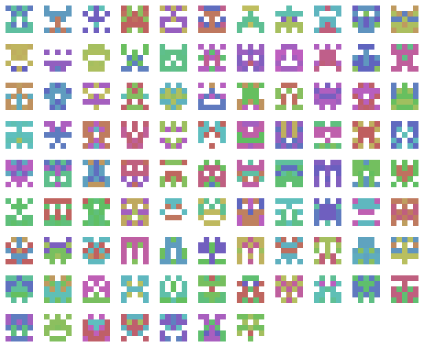

# tridenticon
## A visual hash generator

`tridenticon` is a library and script that can be used to generate visually appealing, milti-colored, immediately recognizable icons from arbitrary data.

To use as a library:

    import tridenticon
    # Generate identicon -> PIL.Image()
    image = tridenticon.generate('Some arbitrary data', scale=8)
    # Display and save image
    image.show()
    image.save('tridenticon.png')

To use from the command line:

    ./tridenticon.py 'Some arbitrary data' 8

Example icons, as produced by `identicon.py --test`:

### Other Notes

This program is free software, released under the Apache License, Version 2.0. See the LICENSE file for more information.

The program's canonical project page resides at https://github.com/simon-v/tridenticon/

I gratefully accept appreciation for my work in material form at __[bitcoincash:qp9ctaaz4rczxwf06wv34mq0ffv9gcvcfsm3sc9nuc](bitcoincash:qp9ctaaz4rczxwf06wv34mq0ffv9gcvcfsm3sc9nuc)__.
